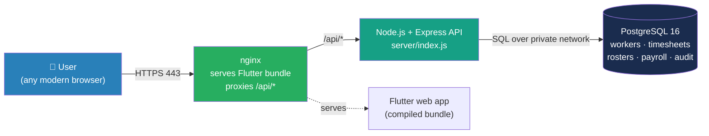
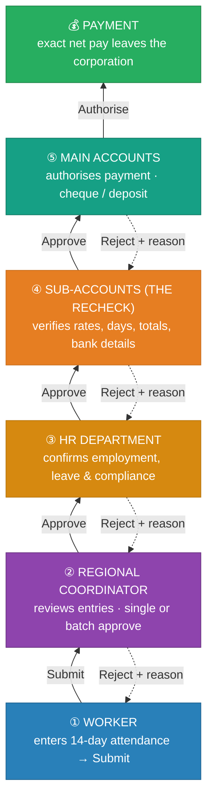
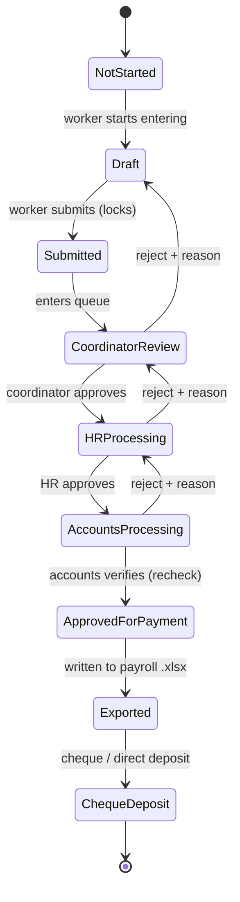
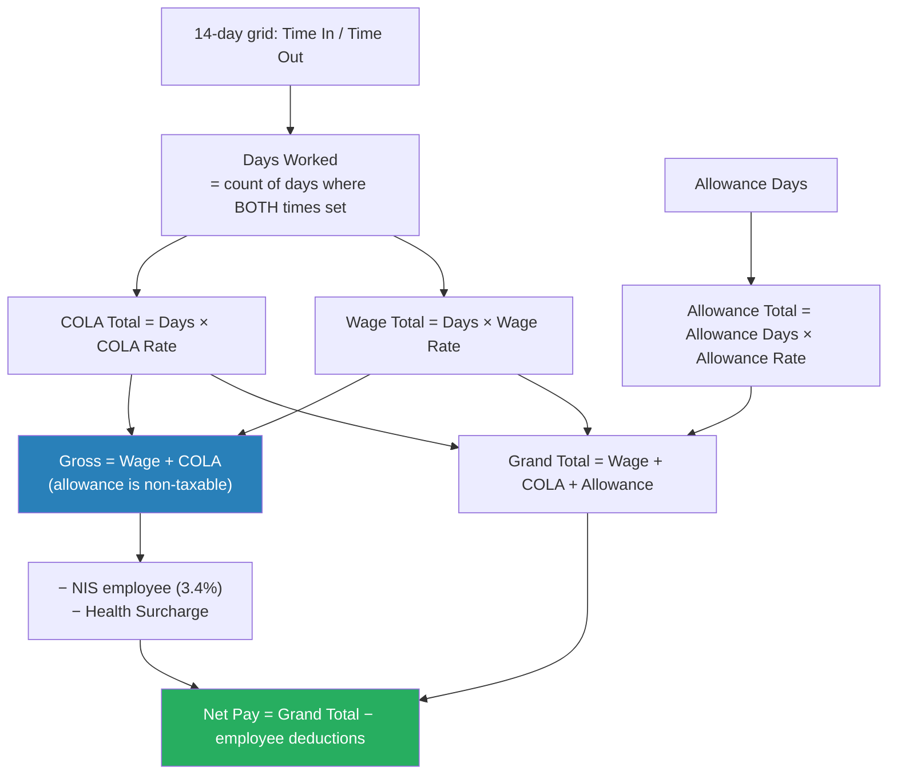
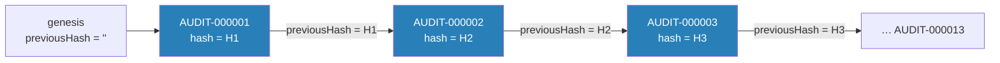

# WorkForce (NPUPS) — Platform Handover Manual

**Digital workflow for worker enrolment, fortnightly timesheets, payroll processing and HR reporting.**
Developed by Laurence Peter · Built with AI support

> **Purpose of this document.** This is the definitive handover reference for the
> team taking ownership of the WorkForce platform. It explains *what the system
> does*, *how work flows through it*, *how every role uses it*, *what the
> colours and dashboards mean*, and *how the tamper-evident audit trail proves
> that nothing was altered behind the scenes*. Read it end-to-end once; then use
> the Table of Contents as a lookup.

---

## Table of Contents

1. [The one-paragraph pitch](#1-the-one-paragraph-pitch)
2. [System architecture at a glance](#2-system-architecture-at-a-glance)
3. [Signing in & the demo accounts](#3-signing-in--the-demo-accounts)
4. [The nine roles](#4-the-nine-roles)
5. [The end-to-end flow (bottom → top)](#5-the-end-to-end-flow-bottom--top)
6. [The timesheet lifecycle & its nine stages](#6-the-timesheet-lifecycle--its-nine-stages)
7. [Payroll automation — "not a penny more or less"](#7-payroll-automation--not-a-penny-more-or-less)
8. [Statutory deductions & net pay](#8-statutory-deductions--net-pay)
9. [Backpay (retroactive rate changes)](#9-backpay-retroactive-rate-changes)
10. [Rosters & attendance defaults](#10-rosters--attendance-defaults)
11. [The Director dashboards & colour coding](#11-the-director-dashboards--colour-coding)
12. [The Audit Trail explained](#12-the-audit-trail-explained)
13. [Worker registry & document verification](#13-worker-registry--document-verification)
14. [Excel export](#14-excel-export)
15. [Bottlenecks & how to prevent them](#15-bottlenecks--how-to-prevent-them)
16. [Security & network requirements](#16-security--network-requirements)
17. [Running & deploying the platform](#17-running--deploying-the-platform)
18. [Troubleshooting](#18-troubleshooting)
19. [Colour reference (one-page)](#19-colour-reference-one-page)
20. [Glossary](#20-glossary)

---

## 1. The one-paragraph pitch

WorkForce replaces a paper-based municipal payroll process — where fortnightly
timesheets travelled by hand through four departments, were re-keyed at every
desk, and were reconciled against bank details on a separate sheet — with a
single digital pipeline. **A worker enters one thing: their attendance.**
Everything else — wage, cost-of-living allowance (COLA), allowance, gross,
National Insurance, Health Surcharge and net pay — is computed by the system
and only ever *verified* by a human, never re-typed. Each timesheet climbs a
fixed nine-stage approval ladder with full visibility for management, and every
change is written to a **tamper-evident, hash-chained audit trail** that can be
proven un-altered in an external review or in court. The result: time-to-first-
payment drops from weeks to days, and every worker is paid their actual salary —
**not a penny more, not a penny less.**

---

## 2. System architecture at a glance

WorkForce is a **Flutter web** front-end talking to a **Node.js + Express** API,
which is the *only* process that touches **PostgreSQL**. The browser never
connects to the database directly.



| Layer | Technology | Notes |
|-------|-----------|-------|
| Front-end | Flutter 3.x / Dart 3.2+ | Compiled to a static web bundle; no backend URL baked in |
| API | Node.js 18 + Express 4 | Same-origin `/api/*`; the only tier that reaches the DB |
| Database | PostgreSQL 16 | Schemas in `db/` — RBAC, domain, edit-locks |
| Infra | Docker + nginx + GitHub Actions | Web image is built in CI and pulled by the host |

**Key design guarantee.** Because the browser calls `/api/*` on the *same
origin* it was served from, the deployed bundle needs no per-environment rebuild
and there is no cross-origin preflight. After login, `Bootstrap.loadAll()` fans
out to `/api/workers`, `/api/timesheets`, `/api/audit-logs`, `/api/rosters`,
`/api/backpay-records` and populates the on-screen data stores. **All data
originates in PostgreSQL** — nothing is hard-coded in the front-end except the
proof-of-concept demo logins.

---

## 3. Signing in & the demo accounts

Open the platform URL in Chrome, Firefox or Edge (1280×720 or higher). Enter
your email and password and click **Login**. You land on the dashboard for your
role. If you see a red **"Backend unreachable"** banner, the API container is
down or misconfigured — see [Troubleshooting](#18-troubleshooting).

Demo / proof-of-concept credentials (staging only — never enable in production):

| Role | Email | Password |
|------|-------|----------|
| System Admin | admin@workforce.app | admin123 |
| Regional Coordinator | coordinator@workforce.app | test123 |
| HR | hr@workforce.app | test123 |
| Worker | worker@workforce.app | test123 |
| Sub-Accounts | accounts@workforce.app | test123 |
| Director / Permanent Secretary | ps@workforce.app | test123 |
| Main Accounts | mainaccounts@workforce.app | test123 |
| Executive Dept | executive@workforce.app | test123 |
| DMCR | dmcr@workforce.app | test123 |

---

## 4. The nine roles

Each user has exactly **one** role, assigned by the System Administrator. The
role decides which screens and actions are available. Read the table
bottom-to-top — that is the order a fortnight actually moves.

| # | Role | What they do | Primary screens |
|---|------|--------------|-----------------|
| 1 | **Worker** | Submit their own fortnightly timesheet (attendance only) | Timesheet · Workers |
| 2 | **Regional Coordinator** | Enter group/paper timesheets; review & approve worker submissions | Dashboard · Review · Timesheet · Workers |
| 3 | **HR Department** | Confirm active employment, leave & programme compliance | Dashboard · HR Review · Workers |
| 4 | **Sub-Accounts Clerk** | **The recheck** — verify rates, days, totals & bank details | Dashboard · Accounts · Export |
| 5 | **Main Accounts Clerk** | Authorise approved payments; manage cheque processing | Dashboard · Accounts · Export |
| 6 | **DMCR** | Worker-data compilation & coordination across corporations | Dashboard · Workers |
| 7 | **Director / Permanent Secretary** | Whole-pipeline oversight & bottleneck detection | Pipeline · Drill Down · Bottlenecks · Workers · Export |
| 8 | **Executive Department** | Programme-level oversight across the corporation | Dashboard · Workers · Export |
| 9 | **System Administrator** | Full access; user management; troubleshooting | All screens |

> **Note on names.** Internally the "Director" oversight role is the
> **Permanent Secretary (`ps`)** account — that is the login that opens the
> Pipeline / Drill Down / Bottlenecks dashboards described in §11.

---

## 5. The end-to-end flow (bottom → top)

A timesheet is *born at the bottom* (a worker's attendance) and *finishes at the
top* (money in the bank). It only ever moves **up** one stage at a time on
approval, or **down** one stage on rejection.



**The two human jobs.** Notice that humans do only the two things that must not
be automated: **record the attendance** (bottom) and **verify the result**
(the recheck). Every arithmetic step in between is the system's job, performed
identically every fortnight.

**Rejection is never silent.** A reject at any stage sends the timesheet back
*one* stage and **requires a written reason**. The originator is notified, and
the reason is visible in the approval history and in the audit trail.

---

## 6. The timesheet lifecycle & its nine stages

Under the hood, a timesheet is a small state machine. These nine stages, their
owners and their colours are defined in code (`lib/models/timesheet_model.dart`)
and are the single source of truth for the colours you see across the app.



| # | Stage | Owner | Colour | Hex | Meaning |
|---|-------|-------|--------|-----|---------|
| 1 | Not Started | Worker | ⬜ Grey | `#9CA3AF` | Timesheet exists, no attendance yet |
| 2 | Draft | Worker | ◼️ Slate | `#6B7280` | Being entered; totals preview live; editable |
| 3 | Submitted | Regional Coordinator | 🟦 Blue | `#2980B9` | Locked by worker; awaiting review |
| 4 | Coordinator Review | Regional Coordinator | 🟪 Purple | `#8E44AD` | Coordinator checking entries |
| 5 | HR Processing | HR Department | 🟧 Amber | `#D68910` | Employment/leave/compliance check |
| 6 | Accounts Processing | Sub-Accounts | 🟧 Orange | `#E67E22` | **The recheck** — verify figures & bank |
| 7 | Approved for Payment | Main Accounts | 🟩 Green | `#27AE60` | Figures confirmed & authorised |
| 8 | Exported | Accounts | 🟦 Teal | `#16A085` | Written to payroll `.xlsx` |
| 9 | Cheque / Direct Deposit | Accounts | 🟦 Navy | `#1A2C4E` | Money issued — terminal state |

> **Editable window.** A timesheet can only be edited while it is **Not Started**
> or **Draft**. Once **Submitted**, it is read-only unless an approver rejects it
> back down.

---

## 7. Payroll automation — "not a penny more or less"

This is the heart of the platform. The worker types attendance; the system
derives everything else. All figures below come straight from
`lib/models/timesheet_model.dart` and are computed deterministically — the same
inputs *always* produce the same cent.



**The formulas (exact):**

| Quantity | Formula |
|----------|---------|
| Days Worked | count of days where **both** Time In and Time Out are set |
| Wage Total | `Days Worked × Wage Rate` |
| COLA Total | `Days Worked × COLA Rate` |
| Allowance Total | `Allowance Days × Allowance Rate` |
| **Grand Total** | `Wage Total + COLA Total + Allowance Total` |
| Gross Salary | `Wage Total + COLA Total` (allowance is **non-taxable**) |
| **Net Pay** | `Grand Total − (NIS employee + Health Surcharge)` |

**Worked example** (Wage $168/day, COLA $30/day, Allowance $25/day):

| | Value |
|---|---|
| Days worked | 10 |
| Wage total | 10 × $168.00 = **$1,680.00** |
| COLA total | 10 × $30.00 = **$300.00** |
| Allowance total | 5 × $25.00 = **$125.00** |
| Grand total | **$2,105.00** |
| Gross (wage + COLA) | $1,980.00 |
| NIS employee (3.4%) | −$67.32 |
| Health Surcharge ($8.25/wk × 2) | −$16.50 |
| **Net pay** | **$2,021.18** |

> The interactive presentation in `presentation/platform-walkthrough.html` lets
> you drag these inputs and watch the statement recompute live — useful for
> demonstrating exactness to stakeholders.

---

## 8. Statutory deductions & net pay

Deductions are modelled in `lib/models/payroll_deductions_model.dart`. Rates
default to Trinidad & Tobago figures and are **versioned by year**
(`DeductionRateTable`), so historical fortnights stay auditable even after a rate
change.

| Deduction | Rate (2026 default) | Basis |
|-----------|---------------------|-------|
| NIS — employee share | **3.4%** of gross | Deducted from the worker |
| NIS — employer share | **6.5%** of gross | Paid by the employer, **never** deducted from the worker |
| Health Surcharge (high band) | **$8.25/week** → ×2 = $16.50/fortnight | When gross **> $469.99** |
| Health Surcharge (low band) | **$4.80/week** → ×2 = $9.60/fortnight | When gross **≤ $469.99** |

- **Gross** for deduction purposes is `Wage + COLA` only — the allowance is
  non-taxable and does not attract NIS or Health Surcharge.
- **Total employer cost** = gross + employer NIS. **Total NIS remitted** =
  employee + employer share.
- All money values are rounded to the cent (`round(v × 100) / 100`).

---

## 9. Backpay (retroactive rate changes)

When a wage or COLA rate is raised **retroactively** (e.g. an annual
collective-agreement increase effective from an earlier date), the system
generates a **backpay record** capturing the exact per-fortnight shortfall — no
manual recalculation. Modelled in `lib/models/backpay_model.dart`.

For each affected fortnight:

```
wage delta = (new daily rate − old daily rate) × days worked
COLA delta = (new COLA rate  − old COLA rate)  × days worked
line total = wage delta + COLA delta
```

The record totals every line and moves through its own small workflow:
**Calculated → Approved → Disbursed** (or **Cancelled**). Each backpay record
carries the id of the originating audit entry (the wage-rate change), so the
trail is closed end-to-end.

---

## 10. Rosters & attendance defaults

The fortnight roster (`lib/models/roster_model.dart`) makes data-entry
*subtraction, not entry*:

- Workers are **present Monday–Friday by default**; data-entry staff simply
  **un-tick** absent days and can record an absence reason.
- **Weekend work is off by default** and only shown if an admin enables it.
- There is a **maximum days-per-fortnight cap (default 10)**, overridable
  per-worker by an admin for exceptional cases. This cap means **no one can be
  recorded — or paid — beyond the maximum**.

---

## 11. The Director dashboards & colour coding

The **Director / Permanent Secretary** login opens a three-tab oversight console
(`lib/screens/ps_dashboard_screen.dart`). This section explains exactly what each
tab shows and what every colour means.

### 11.1 Pipeline tab

A horizontal flow of all nine stages, each rendered in **its own stage colour**
(the swatches in §6), with a live count of timesheets sitting at that stage.
Tapping a stage filters the drill-down. Above it sit four **KPI cards**:

| KPI card | Colour | Meaning |
|----------|--------|---------|
| **Total** | 🟦 Accent blue `#2980B9` | Neutral count of all timesheets in view |
| **Payroll** | 🟩 Green `#27AE60` | Combined payroll value (money = green) |
| **Stalled** | 🟥 Red `#C0392B` when > 0, else 🟩 Green | Items needing attention |
| **Complete** | 🟩 Green `#27AE60` | Timesheets that reached Cheque/Deposit |

> **Colour grammar of the whole app:** **green = healthy / money / done**,
> **red = attention / stalled / rejected**, **amber = warning / in-review /
> threshold**, **blue = neutral information / counts**, and each **pipeline
> stage keeps its own identity colour** so a timesheet is recognisable at a
> glance wherever it appears.

### 11.2 Drill Down tab

A filterable list of individual timesheets. Filters: **Corporation, Stage, Date
Range, Worker,** and an **Overdue/Stalled** toggle. Each timesheet card is tinted
with **its stage's colour** (at low opacity), so you can scan a long list and see
the distribution of stages by colour alone. A stalled item additionally shows
its **"Xh stalled"** age in **red**.

### 11.3 Bottlenecks tab

Automatically surfaces every timesheet that has been **stuck at the same stage
longer than the threshold**. The threshold is **48 hours by default** and is
selectable from **{24, 48, 72, 96} hours** at the top of the tab (⏱️ timer icon
in **amber**). For each stalled item you see the worker, the stage it is stuck
at, how long it has been stalled (in red), and the responsible role. When nothing
is stalled, the tab shows a positive "no bottlenecks" state.

> **How "stalled" is measured.** Each timesheet records `updatedAt` — the moment
> it last changed stage. `timeAtCurrentStage = now − updatedAt`. If that exceeds
> the threshold, the item is flagged. Terminal states (Not Started, Cheque/
> Deposit) are excluded from stall counting.

---

## 12. The Audit Trail explained

The Audit Trail is the platform's **tamper-evidence system**. It is reachable via
the **Workers → Audit Trail** area and is restricted to the System Admin,
Director/PS, HR and DMCR roles. This section answers, in plain language: *what it
is*, *what the hash numbers are*, and *what "chain broken" means* — the three
things every handover reader asks.

### 12.1 What it is

Every meaningful action in the system — a login, a worker created, a document
approved, a stage advanced, a wage rate changed, a payment recorded — is written
as an **immutable audit entry**. Each entry records **who** did it (user, role,
session), **when** (to the millisecond), **what** (action + entity), a
**before → after diff** of every field that changed, and any **supporting
attachments** (e.g. the signed paysheet). Entries are **append-only**: the
database revokes UPDATE and DELETE, so history cannot be quietly edited.

### 12.2 What the hash numbers are for

Each entry carries a **64-character SHA-256 hash** — a digital fingerprint of the
entry's contents *plus the fingerprint of the entry before it*. This is called
**hash chaining**. In formula form (matching `AuditService._computeHash`):

```
hash(entry) = SHA-256(
      previousHash            ← the hash of the entry immediately before
   || id                      ← e.g. AUDIT-000007
   || millisecondsSinceEpoch  ← the timestamp
   || userId || action || entityType || entityId
   || fieldChanges            ← "field|old|new;field|old|new"
   || attachments             ← "id|contentHash|sizeBytes"
)
```



Because each entry's hash **feeds into the next one's hash**, the entries form a
chain. The very first entry links to an empty *genesis* value (`previousHash =
""`). An **attachment content hash** binds the actual file bytes into the chain,
so swapping a file for a different one also breaks the chain.

**In short:** the hash numbers are not IDs or sequence numbers — they are
cryptographic fingerprints whose only job is to make silent tampering
mathematically detectable.

### 12.3 What "chain intact" and "chain broken" mean

At the top of the Audit Trail screen is a badge and a summary line. Pressing
**"Re-verify chain"** (↻) recomputes every hash from the stored contents and
compares it to what is on file, while also checking that each entry's
`previousHash` really equals the previous entry's `hash`.

- **🛡️ Chain Intact — N entries verified.** Every entry's recomputed hash matches
  its stored hash **and** every link matches. Nothing has been altered.
- **⚠️ Chain Broken at entry #N (AUDIT-00000N).** The verifier hit the **first**
  entry whose contents no longer match its fingerprint, *or* whose link to the
  previous entry is wrong. This is exactly what you want to see **if** someone
  edited, inserted, deleted or reordered a record directly in the database:
  the tamper is pinpointed to the first affected entry, and everything after it
  is thrown into doubt.

> ### ⚠️ Fixed in this handover: the false "Chain Broken at entry #1"
>
> Previously the badge reported **"Chain broken at entry #1 (AUDIT-000001)"** on
> a perfectly clean database. That was a **false alarm, not real tampering** —
> and it has been corrected. Two root causes were fixed:
>
> 1. **The seeded history carried placeholder fingerprints.** The demo audit
>    rows in `db/domain_schema.sql` were stored with a stand-in hash
>    (`sha256(id || '|seed')`) instead of a *real* chain hash, so the app's
>    verifier — which recomputes the genuine fingerprint — rejected the very
>    first row. The seed now computes **real chain hashes** with the exact same
>    formula the app uses, so a freshly loaded database verifies as **Chain
>    Intact** while any *genuine* later tampering still breaks it.
> 2. **Timestamp precision mismatch on reload.** The fingerprint used microsecond
>    time, but the API transports timestamps at **millisecond** precision — so
>    even legitimately added entries could fail re-verification after a page
>    reload. The fingerprint now uses millisecond time on both sides
>    (`AuditService._computeHash` and the SQL seed), so the chain survives a
>    round-trip through the database.
>
> This was verified against a live PostgreSQL 16 instance: all 13 seeded entries
> now report **Chain Intact**, the first entry's hash matches an independent
> reference implementation to the character, and deliberately editing a seeded
> value correctly re-breaks the chain at that entry.

### 12.4 Reading an audit entry

Tap any entry to expand it. You will see: Entry ID, exact timestamp, User ID,
Session ID, Entity ID, any note, the entry's **Chain Hash** (selectable, for
copying into an external verifier), the **field changes** shown as red *old* →
green *new* chips, and any **attachments** with their type, size and SHA-256
prefix. Action icons are colour-coded — green for creates/approvals, red for
deletes/rejections, amber for rate and roster changes, blue for updates/uploads.

You can filter by **action type, entity type, date range** and free-text search,
and export the whole chain as JSON for offline/printed compliance review.

---

## 13. Worker registry & document verification

The **Workers** tab (available to all roles) lists every registered worker with a
photo/initials avatar, name, position, corporation, and a **document
verification** progress bar. Each worker requires five compliance documents:
**NIS Registration Card, Birth Certificate, Bank Letter, ID Card, Police
Certificate.** The badge is:

| Badge | Colour | Meaning |
|-------|--------|---------|
| Verified | 🟩 Green | All 5 documents uploaded |
| Partial | 🟧 Orange | Some documents uploaded |
| Missing | 🟥 Red | No documents on file |

Tap a worker to open Personal Information, Bank Information and Document
Verification, and to initiate uploads. Search matches any part of a name, NIS
number or ID number; filters cover document status and corporation.

---

## 14. Excel export

Accounts (and Admin/Director) can generate the payroll `.xlsx` for a group:
select **Corporation → Group Number (1–12) → Fortnight Start Date** (the system
snaps to the correct Monday), review the pre-populated worker list, and click
**Generate Export**. The file matches the official timesheet template —
title header, per-day Time In/Out columns, calculated Wage/COLA/Allowance/Total
columns, and signature lines for Supervisor, Coordinator and Corporation — with
borders and alignment ready for printing.

---

## 15. Bottlenecks & how to prevent them

A pipeline is only as fast as its slowest desk. The system already *detects*
stalls (§11.3); here is how to *prevent* them.

| Where it stalls | Symptom | Built-in prevention |
|-----------------|---------|---------------------|
| Coordinator Review | Queue piles up card-by-card | **Batch approve** — select the whole queue and approve in one action |
| HR Processing | Sheet sits without a decision | **Reject-with-reason** bounces it back immediately rather than stalling silently |
| Accounts Processing | Bank-detail mismatch on the recheck | Bank fields are **read-only from the verified registry**, so the recheck rarely fails here |
| Submitted (paper workers) | Workers without digital access | **Group entry** — a coordinator digitises up to 12 workers from one paper form |
| Any stage | Nobody knows where the file is | **48h bottleneck detection** names every overdue sheet *and its owner* on the Director's tab |
| Draft | Over-max attendance recorded | **Roster cap (10 days)** blocks anyone being recorded — or paid — beyond the maximum |

**Recommended operating rhythm:** Coordinators clear their review queue at least
once per working day; HR and Accounts check their queues each morning; the
Director reviews the Bottlenecks tab twice a week and reassigns anything past
48 hours. The same stalled-item signal that feeds the Director can, as the
programme scales, drive automated reminders and reassignment.

---

## 16. Security & network requirements

This platform handles personal data — NIS numbers, ID numbers, bank account
details and payroll figures — so transport security is mandatory.

| Port | Protocol | Purpose | Required |
|------|----------|---------|----------|
| **443** | HTTPS/TLS | Encrypted web traffic (primary access) | **Yes — mandatory** |
| **80** | HTTP | Redirect to 443 only | Redirect only |

- **All traffic must be encrypted** with TLS 1.2 or higher. Port 80 should only
  issue an automatic redirect to HTTPS — it must never serve application content
  in plaintext.
- Obtain a certificate from a trusted public CA (e.g. Let's Encrypt, DigiCert)
  and configure nginx on the 443 server block, with an 80→443 redirect.
- Personally identifiable data is **masked** in the UI (bank, NIS, ID) via
  `security_utils`, and the API is the only tier that reaches the database.

---

## 17. Running & deploying the platform

**One-command demo (bundles its own seeded Postgres):**

```sh
docker compose up --build
# web  → http://localhost:8081   (Flutter via nginx, proxies /api/*)
# api  → http://localhost:8080   (GET /api/health for liveness)
# db   → localhost:5432          (Postgres 16, db/*.sql auto-loaded on first boot)
```

**Load the schemas manually** (managed Postgres, in this order):

```sh
psql "$DATABASE_URL" -f db/rbac_schema.sql        # roles & permissions
psql "$DATABASE_URL" -f db/domain_schema.sql      # workers, timesheets, payroll, audit (+ seed)
psql "$DATABASE_URL" -f db/edit_locks_schema.sql  # optimistic concurrency locks
```

Sanity-check the seed: `workers` = 19, `timesheets` = 17,
`timesheet_daily_entries` = 238, `rosters` = 6, `app_audit_logs` = 13.

**Production (Coolify).** The web image is **built in GitHub Actions**
(`flutter build web --release` peaks at ~1.6 GB RAM and would overwhelm a small
deploy host) and published to `ghcr.io/<owner>/npups:latest`; Coolify just pulls
it. Deploy with `docker-compose.prod.yml` (web + api only), set `DATABASE_URL`
in Coolify env vars, point the public domain at the `web` service, and load the
schemas into the managed Postgres once before the first deploy. See `README.md`
for the full Coolify checklist.

---

## 18. Troubleshooting

| Symptom | Likely cause | Fix |
|---------|--------------|-----|
| Red **"Backend unreachable"** banner | API container down, or `API_UPSTREAM` points at the wrong host | `docker compose logs api`; confirm `http://localhost:8080/api/health` responds |
| **"Chain Broken"** on a clean DB | (Historically) placeholder seed hashes / timestamp precision | **Fixed** — reload `db/domain_schema.sql`; the seed now writes real chain hashes (§12.3) |
| **"Chain Broken"** on a live DB | Genuine tampering, or a manual SQL edit to `app_audit_logs`/field changes/attachments | Investigate the named entry (#N) — the audit trail deliberately flags exactly this |
| Users created "at work" not visible "at home" | Two machines pointing at different databases | Point both at the same managed Postgres (data lives in the DB, not the browser) |
| Dashboard empty after login | `Bootstrap.loadAll()` fetch failed | Check the API health endpoint and browser console/network tab |
| Timesheet won't edit | It has been **Submitted** | Only Not Started / Draft are editable; an approver must reject it back |

---

## 19. Colour reference (one-page)

**Semantic colours (whole app):**

| Colour | Hex | Used for |
|--------|-----|----------|
| 🟩 Success green | `#27AE60` | Healthy, money, complete, approvals |
| 🟥 Error red | `#C0392B` | Stalled, rejected, deletions, attention |
| 🟧 Warning amber | `#D68910` | Warnings, in-review, thresholds, rate changes |
| 🟦 Info / accent blue | `#2980B9` | Neutral counts & information |
| 🔵 Primary navy | `#1A2C4E` | App chrome, headers, terminal "paid" stage |

**Pipeline stage colours:** Grey `#9CA3AF` · Slate `#6B7280` · Blue `#2980B9` ·
Purple `#8E44AD` · Amber `#D68910` · Orange `#E67E22` · Green `#27AE60` ·
Teal `#16A085` · Navy `#1A2C4E` (in flow order, stages 1→9).

**Audit action icon colours:** green = create/approve/activate/stage-advance ·
red = delete/deactivate/reject/reverse · amber = wage-rate/backpay/roster
changes · blue = update/upload/import/export.

---

## 20. Glossary

| Term | Meaning |
|------|---------|
| **COLA** | Cost-of-Living Allowance, paid per day worked; part of gross |
| **NIS** | National Insurance Scheme contribution (employee 3.4%, employer 6.5%) |
| **Health Surcharge** | Weekly statutory levy (×2 per fortnight), banded by gross |
| **Gross** | Wage + COLA (the basis for deductions; allowance excluded) |
| **Net pay** | Grand Total − employee deductions — the amount actually paid |
| **Grand Total** | Wage + COLA + Allowance (before deductions) |
| **Fortnight** | The two-week pay period; 14 attendance days |
| **Stage** | One of the nine positions in the approval pipeline |
| **Stalled / Bottleneck** | A timesheet stuck at one stage beyond the threshold (default 48h) |
| **Backpay** | Retroactive shortfall owed after a rate increase |
| **Hash chain** | The linked SHA-256 fingerprints that make the audit trail tamper-evident |
| **Chain intact / broken** | Whether every audit fingerprint still matches its contents and its link |
| **RBAC** | Role-Based Access Control — one role per user, gating every screen |

---

*Document version 1.0 — 2026 · WorkForce (NPUPS) · Developed by Laurence Peter.*
*For the interactive walkthrough of this flow, open
`presentation/platform-walkthrough.html`.*
